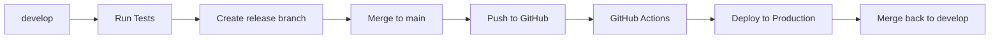

# Git-Flow Deployment Guide

## 🚀 One-Command Deployment System

### Your Daily Workflow (Simple!)

```bash
# 1. Work on develop branch (that's all you need to care about!)
git checkout develop
git pull origin develop

# Make your changes, commit normally
git add .
git commit -m "Add new feature"
git push origin develop

# 2. When ready to deploy - ONE COMMAND:
./bin/release "1.2.3" "Description of changes"
```

**That's it!** The script handles everything else automatically.

---

## 🏷️ Branch Rules (Never Break These!)

| Branch | Purpose | You Touch? | Deploy Trigger |
|--------|---------|------------|----------------|
| `develop` | ✅ **Your workspace** | YES - Work here daily | No |
| `main` | ❌ Production mirror | NO - Hands off! | YES - Auto deploy |
| `feature/*` | Optional feature branches | Optional | No |
| `release/*` | Temporary (auto-created) | NO - Script handles | No |

### ⚠️ Critical Rules:
- **NEVER** push directly to `main`
- **NEVER** merge manually to `main`
- **ALWAYS** work on `develop`
- **ONLY** use `./bin/release` to deploy

---

## 📄 What Happens When You Run `./bin/release`?



### Step-by-Step Process:
1. ✅ **Tests run locally** (must pass)
2. 🌿 **Release branch created** (temporary)
3. 🔀 **Merged to main** (triggers deployment)
4. 📤 **Pushed to GitHub** (GitHub Actions starts)
5. 🧪 **Tests run again** (in GitHub Actions)
6. 🚀 **Deployed to production** (if tests pass)
7. 🔄 **Merged back to develop** (keeps branches in sync)
8. 🧹 **Cleanup** (removes temporary branches)

---

## 🔥 Emergency Procedures

### 🆘 Hotfix (Emergency Production Fix)
```bash
# 1. Create hotfix from main
git checkout main
git pull origin main
git checkout -b hotfix/critical-fix

# 2. Make your fix
git add .
git commit -m "Fix critical bug"

# 3. Deploy hotfix
./bin/release "1.2.4" "Emergency fix for critical bug"
```

### ⏹️ Stop Deployment (If Something Goes Wrong)
```bash
# Cancel GitHub Actions (go to GitHub web interface)
# 1. Go to: https://github.com/benjaminfauchald/b2b/actions
# 2. Click the running workflow
# 3. Click "Cancel workflow"
```

### ⏪ Rollback (Undo Last Deployment)
```bash
# Find last good version
git tag --sort=-version:refname | head -5

# Deploy previous version
./bin/release "1.2.2" "Rollback to stable version"
```

---

## 📊 Version Numbers (Semantic Versioning)

| Change Type | Version Bump | Example |
|-------------|--------------|----------|
| Bug fixes | Patch: `1.2.3` → `1.2.4` | `./bin/release "1.2.4" "Fix login bug"` |
| New features | Minor: `1.2.3` → `1.3.0` | `./bin/release "1.3.0" "Add user profiles"` |
| Breaking changes | Major: `1.2.3` → `2.0.0` | `./bin/release "2.0.0" "New API structure"` |

---

## 📦 Common Commands

### Check Status
```bash
# What branch am I on?
git branch --show-current

# What's different from production?
git log main..develop --oneline

# Check deployment status
# Go to: https://github.com/benjaminfauchald/b2b/actions
```

### Feature Branch Workflow (Optional)
```bash
# Create feature branch
git checkout develop
git checkout -b feature/user-authentication

# Work on feature
git add .
git commit -m "Add login form"

# Merge back to develop
git checkout develop
git merge feature/user-authentication
git branch -d feature/user-authentication
git push origin develop

# Deploy when ready
./bin/release "1.3.0" "Add user authentication"
```

---

## ❓ Troubleshooting

### "Tests failed" Error
```bash
# Run tests locally to see what's wrong
bundle exec rspec

# Fix the failing tests, then try again
./bin/release "1.2.3" "Fix tests and deploy"
```

### "Working directory not clean" Error
```bash
# Check what's uncommitted
git status

# Either commit or stash changes
git add .
git commit -m "Save work"
# OR
git stash

# Then try release again
./bin/release "1.2.3" "Deploy after cleanup"
```

### "Deployment failed" (Check GitHub Actions)
1. Go to https://github.com/benjaminfauchald/b2b/actions
2. Click the failed workflow
3. Read the error logs
4. Fix the issue and try again

---

## 📋 Daily Checklist

### Morning Routine:
- [ ] `git checkout develop`
- [ ] `git pull origin develop`
- [ ] Start coding!

### Before Going Home:
- [ ] `git add .`
- [ ] `git commit -m "Your changes"`
- [ ] `git push origin develop`

### When Ready to Deploy:
- [ ] `./bin/release "X.Y.Z" "What you built"`
- [ ] Check GitHub Actions: https://github.com/benjaminfauchald/b2b/actions
- [ ] Verify on production: https://app.connectica.no

---

**Remember: You only need to work on `develop` branch. The script handles everything else!** 🎉
